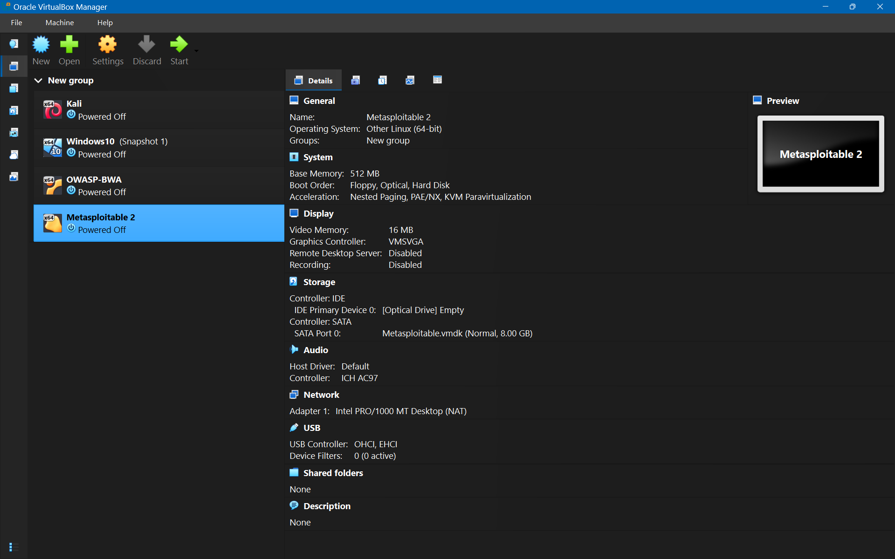

# Lab 2: Environment Setup

## 1. Install Virtualization Software
You need a hypervisor to run virtual machines (VMs).
*   VirtualBox (Recommended for beginners, Free & Open Source)
    *   Download: [https://www.virtualbox.org/wiki/Downloads](https://www.virtualbox.org/wiki/Downloads)
    *   Steps: Download the "Windows hosts" installer -> Run `.exe` -> Follow default prompts -> Install "Extension Pack" (optional but recommended for USB support).
*   VMware Workstation Player (Free for non-commercial use)
    *   Download: [https://www.vmware.com/products/workstation-player.html](https://www.vmware.com/products/workstation-player.html)

## 2. Install Kali Linux (Attacker Machine)

Kali is a Debian-based Linux distribution aimed at advanced Penetration Testing and Security Auditing.
*   Method A: Pre-built Virtual Machine (Easiest)
    1.  Go to [https://www.kali.org/get-kali/#kali-virtual-machines](https://www.kali.org/get-kali/#kali-virtual-machines)
    2.  Download the VirtualBox (or VMware) 64-bit version (`.7z` file).
    3.  Extract the file using 7-Zip.
    4.  Open VirtualBox -> Click Add (Blue icon) -> Select the `.vbox` file from the extracted folder.
    5.  Default Credentials: `kali` / `kali`.
*   Method B: Installer Image (ISO)
    1.  Download the "Installer Image" ISO.
    2.  Create a New VM in VirtualBox (Type: Linux, Version: Debian 64-bit).
    3.  Mount the ISO and go through the installation process (partitioning, user setup).

## 3. Install Target Machines
WARNING: These machines are intentionally vulnerable. NEVER expose them to the open internet (Bridge Mode). Always use Host-Only or NAT Network.

### Metasploitable2 (Vulnerable Linux VM)

*   Description: An Ubuntu-based VM designed to be exploited.
*   Steps:
    1.  Download from SourceForge: [https://sourceforge.net/projects/metasploitable/](https://sourceforge.net/projects/metasploitable/)
    2.  Extract the zip file.
    3.  In VirtualBox: Click New -> Name: "Metasploitable" -> Type: Linux -> Version: Ubuntu (64-bit).
    4.  Memory: 512MB or 1024MB.
    5.  Hard Disk: Choose "Use an existing virtual hard disk file" -> Select the `Metasploitable.vmdk` file you extracted.
    6.  Default Credentials: `msfadmin` / `msfadmin`.

## 4. Video Walkthrough
<video controls src="Lab-walkthrough.mp4" width="100%"></video>
